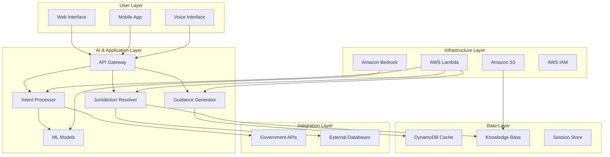

# Design Document: JanWay Civic Guidance System

## Overview

JanWay is an AI-powered civic guidance system built on AWS serverless architecture that helps citizens navigate government services by understanding their intent, resolving jurisdiction conflicts, and providing step-by-step guidance. The system operates as a read-only guidance layer that integrates with existing government portals without replacing them.

The core innovation lies in combining natural language processing with jurisdiction resolution algorithms to eliminate the common citizen problem of being redirected between government offices. The system uses a layered architecture optimized for scalability, cost-efficiency, and multilingual support.

## Architecture

The system follows a five-layer serverless architecture designed for high availability and cost-effective public sector deployment:



## Components and Interfaces

### User Layer Components

**Web Interface**
- Responsive web application supporting text and voice input
- Multilingual UI with language detection and switching
- Accessibility features for low-literacy and elderly users
- Progressive web app capabilities for offline basic functionality

**Mobile Application**
- Native mobile app with voice-first design
- Location services integration for automatic jurisdiction detection
- Offline caching of recent guidance and common services
- Push notifications for service updates and reminders

**Voice Interface**
- Integration with Amazon Lex for natural language understanding
- Support for regional languages and dialects
- Voice output using Amazon Polly for guidance reading
- Conversation state management for multi-turn interactions

### AI & Application Layer Components

**Intent Processor**
- AWS Lambda function powered by Amazon Bedrock LLM
- Processes natural language queries to extract service intent
- Handles multilingual input with automatic language detection
- Maintains conversation context for clarification questions
- Maps citizen language to official government service categories

**Jurisdiction Resolver**
- Rule-based engine with ML-assisted conflict resolution
- Processes location data against administrative boundary databases
- Handles overlapping jurisdictions and recent boundary changes
- Provides confidence scores for jurisdiction assignments
- Escalates ambiguous cases with multiple options

**Guidance Generator**
- Template-based system with dynamic content generation
- Creates step-by-step instructions based on service type and jurisdiction
- Integrates real-time data from government portals
- Generates alternative paths and escalation options
- Formats output for different user literacy levels

### Data Layer Components

**DynamoDB Cache**
- High-performance caching of frequently accessed government data
- Session storage for multi-turn conversations
- User preference storage (language, location, accessibility needs)
- Query analytics and usage patterns

**Knowledge Base (S3 + Vector Database)**
- Government service definitions and procedures
- Administrative boundary data and jurisdiction rules
- Office contact information and service hours
- Document requirements and fee structures
- Historical query patterns and successful resolutions

**Session Store**
- Temporary storage for conversation state
- User location and preference caching
- Query history for session continuity
- Security tokens for government API access

### Integration Layer Components

**Government API Connectors**
- Read-only integrations with official government portals
- Standardized adapters for different government systems
- Rate limiting and error handling for external dependencies
- Data validation and freshness checking

**External Database Interfaces**
- Secure connections to administrative boundary databases
- Office directory and contact information systems
- Service catalog and procedure databases
- Real-time status feeds for office availability

## Data Models

### Core Data Structures

```typescript
interface CitizenQuery {
  queryId: string;
  sessionId: string;
  timestamp: Date;
  language: string;
  inputType: 'text' | 'voice';
  rawInput: string;
  processedIntent: ServiceIntent;
  location?: LocationData;
  userPreferences?: UserPreferences;
}

interface ServiceIntent {
  serviceCategory: string;
  specificService?: string;
  urgency: 'normal' | 'urgent' | 'emergency';
  confidence: number;
  alternativeIntents?: string[];
  requiredClarifications?: string[];
}

interface LocationData {
  coordinates?: {lat: number, lng: number};
  address?: string;
  administrativeLevel: {
    state: string;
    district: string;
    block?: string;
    village?: string;
  };
  jurisdictionAmbiguity?: boolean;
}

interface JurisdictionResolution {
  primaryAuthority: Authority;
  alternativeAuthorities?: Authority[];
  confidence: number;
  conflictReason?: string;
  escalationPath?: Authority[];
}

interface Authority {
  authorityId: string;
  name: string;
  type: 'central' | 'state' | 'district' | 'local';
  contactInfo: ContactInfo;
  servicesOffered: string[];
  operatingHours: OperatingHours;
  onlinePortal?: string;
}

interface GuidanceResponse {
  steps: GuidanceStep[];
  requiredDocuments: Document[];
  estimatedTime: string;
  estimatedCost?: string;
  alternativePaths?: GuidanceStep[][];
  escalationOptions?: EscalationOption[];
}

interface GuidanceStep {
  stepNumber: number;
  description: string;
  actionType: 'visit' | 'online' | 'document' | 'payment';
  location?: string;
  url?: string;
  expectedDuration: string;
  prerequisites?: string[];
}
```

### Database Schema Design

**DynamoDB Tables:**

1. **Sessions Table**
   - Partition Key: sessionId
   - TTL: 24 hours
   - Stores conversation state and user preferences

2. **Cache Table**
   - Partition Key: cacheKey (service + location hash)
   - Sort Key: timestamp
   - TTL: 1 hour for dynamic data, 24 hours for static data

3. **Analytics Table**
   - Partition Key: date
   - Sort Key: queryId
   - Stores anonymized query patterns and success metrics

**S3 Data Organization:**
- `/knowledge-base/services/` - Service definitions and procedures
- `/knowledge-base/boundaries/` - Administrative boundary data
- `/knowledge-base/authorities/` - Office and contact information
- `/models/` - ML model artifacts and embeddings
- `/templates/` - Guidance templates and multilingual content

## Error Handling

### Error Categories and Responses

**Input Processing Errors**
- Unrecognized language: Request language selection with auto-detection
- Unclear intent: Ask targeted clarification questions
- Missing location: Request location or provide location-independent guidance
- Voice recognition failure: Offer text input alternative

**Jurisdiction Resolution Errors**
- Multiple valid jurisdictions: Present ranked options with explanations
- No matching jurisdiction: Escalate to state/central level authorities
- Outdated boundary data: Use cached data with disclaimer and update flag
- Conflicting authority claims: Provide all options with contact information

**External System Errors**
- Government API unavailable: Use cached data with freshness disclaimer
- Timeout errors: Provide partial guidance and suggest retry
- Authentication failures: Log for admin review, provide general guidance
- Rate limiting: Queue request and provide estimated wait time

**Data Quality Issues**
- Incomplete service information: Provide available data and suggest direct contact
- Outdated contact information: Flag for update and provide alternative contacts
- Missing translations: Fall back to primary language with translation note

### Graceful Degradation Strategy

1. **Full Functionality**: All systems operational
2. **Limited AI**: Use cached responses and rule-based fallbacks
3. **Offline Mode**: Provide cached guidance and contact information
4. **Emergency Mode**: Display emergency contacts and basic service information

## Testing Strategy

The testing approach combines comprehensive unit testing for individual components with property-based testing to verify system-wide correctness properties. This dual approach ensures both specific functionality and universal system behaviors are validated.

**Unit Testing Focus:**
- Component integration points and API contracts
- Error handling and edge cases for each service
- Multilingual processing and output formatting
- External system integration mocking and failure scenarios

**Property-Based Testing Focus:**
- Universal properties that must hold across all inputs and scenarios
- System behavior consistency under various load conditions
- Data integrity and security properties
- End-to-end workflow correctness

**Testing Infrastructure:**
- Jest for unit testing with comprehensive mocking
- Property-based testing using fast-check library
- AWS SAM for local serverless testing
- Postman/Newman for API integration testing
- Load testing with Artillery for performance validation

**Test Configuration:**
- Minimum 100 iterations per property test
- Each property test tagged with: **Feature: janway, Property {number}: {property_text}**
- Continuous integration with automated test execution
- Performance benchmarks for sub-3-second response times

## Correctness Properties

*A property is a characteristic or behavior that should hold true across all valid executions of a system—essentially, a formal statement about what the system should do. Properties serve as the bridge between human-readable specifications and machine-verifiable correctness guarantees.*

### Property 1: Multilingual Processing Consistency
*For any* supported language and valid service query, processing the query should produce equivalent service intent regardless of the input language used.
**Validates: Requirements 1.3, 1.5, 6.1**

### Property 2: Intent Processing Completeness
*For any* citizen query, the Intent_Processor should either extract a valid service intent or request specific clarification, never leaving queries unprocessed.
**Validates: Requirements 1.1, 2.1**

### Property 3: Ambiguity Handling Consistency
*For any* ambiguous query (multiple possible intents or services), the system should provide clarification options or multiple choices rather than making arbitrary selections.
**Validates: Requirements 1.4, 2.2, 2.4**

### Property 4: Jurisdiction Resolution Determinism
*For any* valid location and service type combination, the Jurisdiction_Resolver should produce consistent jurisdiction assignments across multiple queries.
**Validates: Requirements 3.1, 3.2**

### Property 5: Authority Identification Completeness
*For any* resolved jurisdiction and service type, the system should identify at least one responsible authority with complete contact information (address, phone, hours).
**Validates: Requirements 4.1, 4.2, 4.4**

### Property 6: Guidance Generation Completeness
*For any* identified authority and service type, the Guidance_Generator should produce sequential steps that include all required documents, timeframes, and available service channels.
**Validates: Requirements 5.1, 5.2, 5.3, 5.5**

### Property 7: Alternative Path Provision
*For any* service request where the primary path is unavailable, the system should provide at least one alternative authority or escalation option.
**Validates: Requirements 7.1, 7.2, 7.5**

### Property 8: Response Time Consistency
*For any* query under normal system load, the response time should not exceed 3 seconds from input to guidance delivery.
**Validates: Requirements 8.1**

### Property 9: Data Security Enforcement
*For any* user interaction, all data should be encrypted in transit and at rest, and no personally identifiable information should persist beyond session duration.
**Validates: Requirements 9.1, 9.2**

### Property 10: Read-Only Access Enforcement
*For any* external government system interaction, the system should only perform read operations and never attempt write, update, or delete operations.
**Validates: Requirements 9.3, 10.1, 10.5**

### Property 11: Cache Behavior Consistency
*For any* frequently accessed government data, the system should cache the information and serve cached responses when external systems are unavailable, with appropriate freshness disclaimers.
**Validates: Requirements 10.2, 10.3, 10.4**

### Property 12: Language Accessibility Compliance
*For any* generated guidance, the language complexity should be appropriate for low-literacy users, and technical terms should include plain language explanations.
**Validates: Requirements 6.2, 6.4**

### Property 13: Service Option Completeness
*For any* available government service, both online and offline access options should be provided when they exist, along with emergency or urgent alternatives when applicable.
**Validates: Requirements 5.3, 7.3**

### Property 14: Terminology Consistency
*For any* concept or service term, the same terminology should be used consistently across all supported languages and user interactions.
**Validates: Requirements 2.5, 6.5**

### Property 15: External System Integration Reliability
*For any* step requiring external system access, proper links, navigation instructions, and fallback options should be provided when systems are unavailable.
**Validates: Requirements 5.4, 10.3**